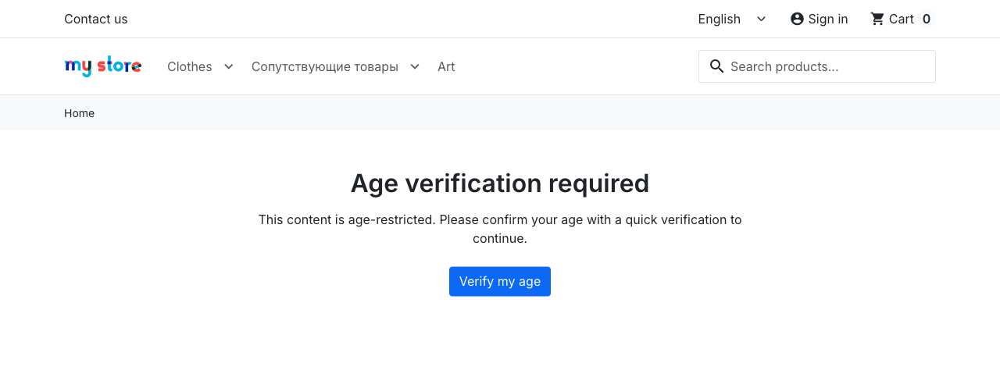
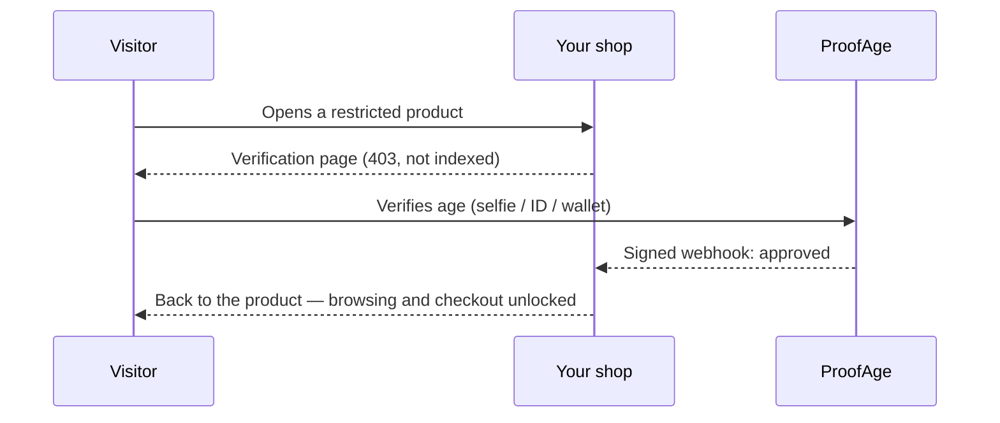
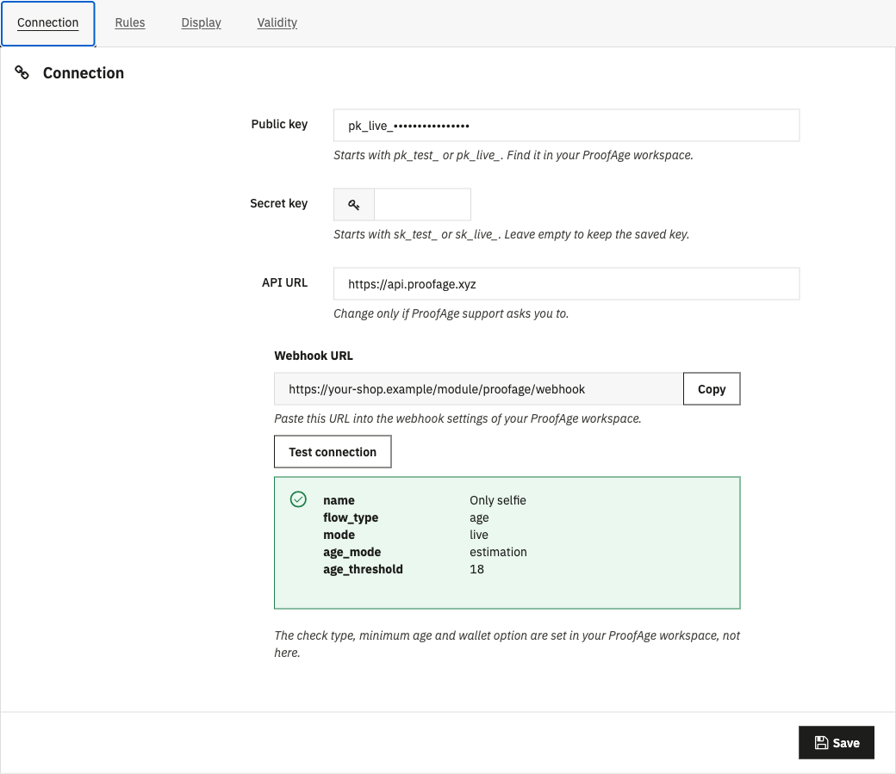
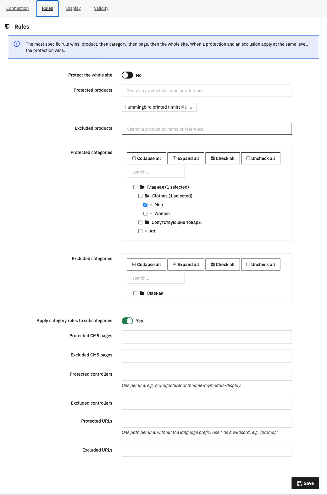
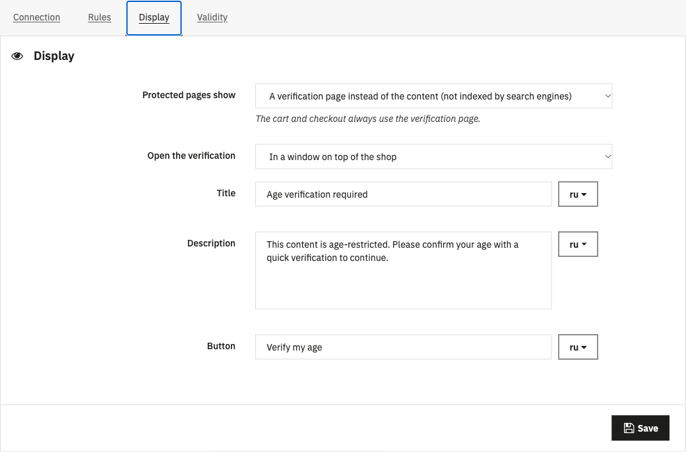
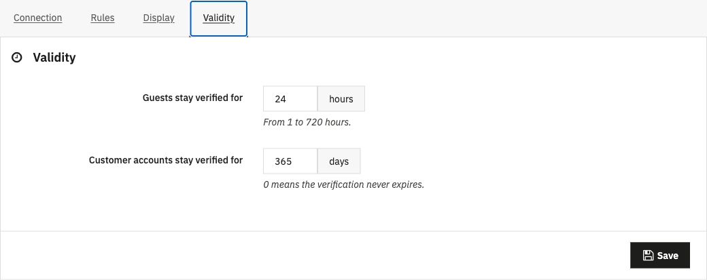
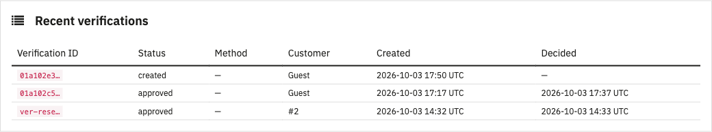

# ProofAge Age Verification for PrestaShop

**Sell age-restricted products with confidence.**
Verify your customers' age with a selfie, an ID document or a digital identity wallet — and keep restricted products, categories and pages locked until they do.

---

  

## Why ProofAge

- **Real protection, not a pop-up.** Rules are enforced on the server: restricted pages are never sent to unverified visitors, add-to-cart is refused, and an order with a restricted product cannot be created without a verification — whatever theme, checkout or payment module you use.
- **Protect exactly what you need.** A single product, whole categories, CMS pages, any front controller or URL pattern — or the entire shop, with exclusions.
- **Verify once.** Guests stay verified for the time you choose; customers keep their verification on their account, on any device.
- **Privacy first.** Your shop stores only verification IDs, statuses and dates. Documents and photos never touch your server.
- **Ready for the EU digital identity wallet.** Selfie age estimation, document checks and digital-ID wallets are configured in your ProofAge workspace — the module works with all of them.

## How it works

## Features

| | |
|---|---|
| 🛡️ **Rules** | Products, categories (with subcategories), CMS pages, controllers, URL patterns, whole shop — plus exclusions. The most specific rule wins. |
| 🛒 **Cart & checkout** | Automatically locked while they contain a restricted product. Add-to-cart, quick view and order creation are blocked server-side. |
| 🖼️ **Display** | Full verification page (content hidden, not indexed) or a blurred overlay (content stays indexable). |
| 🪟 **Verification window** | Opens on top of your shop, or on the ProofAge page with an automatic return. |
| ⏱️ **Validity** | Guests: 1–720 hours. Customer accounts: any number of days, or forever. Guest approval moves to the account at sign-in. |
| 🔔 **Webhooks** | Signed and idempotent, with automatic status sync as a fallback. |
| 🧾 **Back office** | Verification card on every order and customer page (with reset), logs of verifications and webhook deliveries, connection test. |
| 🌍 **Languages** | English, French, Spanish, Italian. Verification texts are editable per language. |
| 🔐 **GDPR** | Works with the PrestaShop GDPR module: data export and anonymisation on customer deletion. |
| 🏬 **Multistore** | Settings and verifications are kept per shop. |

## Requirements

- PrestaShop **8.1 – 9.x**
- PHP **7.2.5+** with cURL
- An **HTTPS** storefront
- A **[ProofAge](https://proofage.xyz) account** — verifications are billed by ProofAge

## Installation

1. Download **[proofage.zip](https://github.com/ProofAge/prestashop-plugin/releases/latest/download/proofage.zip)** from the latest release.
2. In your back office open **Modules → Module Manager → Upload a module** and drop the ZIP.
3. Click **Configure**.

> Download the ZIP from **Releases**, not GitHub's “Download source code” — the source archive contains development files and a different folder name.

## Configuration

### 1. Connect your ProofAge workspace

1. In your ProofAge workspace copy the **public key** (`pk_test_…` / `pk_live_…`) and **secret key** (`sk_test_…` / `sk_live_…`) and paste them into the **Connection** tab.
2. Copy the **Webhook URL** shown in the module into your workspace's webhook settings.
3. Click **Test connection** — you'll see the workspace name, mode, check type and minimum age.

The check type (age or identity), minimum age and verification methods are set **in your ProofAge workspace**. Start with a test workspace, then switch the keys to a live one.

### 2. Choose what to protect

**Precedence:** product → category → page (CMS, controller, URL) → whole shop. At the same level, protection beats exclusion.

- *Whole shop protected, “Accessories” excluded* → everything needs verification except accessories.
- *“Wine” protected, “Grape juice” product excluded* → all wines need verification, the juice doesn't.

### 3. Pick the look and the validity

  
  

### 4. Follow verifications

Every order and customer page shows a verification card; **Reset verification** asks a customer to verify again.

## FAQ

<b>Do I need a ProofAge account?</b>

Yes. The module connects your shop to your ProofAge workspace, where verifications run and are billed. Create an account at [proofage.xyz](https://proofage.xyz).

<b>Which verification methods are supported?</b>

Whatever your workspace offers: selfie age estimation, ID document verification, and digital identity wallets (EUDI), with selfie as a fallback. You choose them in ProofAge, not in the module.

<b>Can visitors bypass the check by disabling JavaScript?</b>

No. Pages are gated by the server, add-to-cart and quick view are refused server-side, and order creation is blocked for unverified carts regardless of the checkout or payment module.

<b>What do you store about my customers?</b>

Only verification IDs, statuses, the method used (wallet or face/document) and dates. No images, documents or birth dates are stored in your shop.

<b>Will protected pages disappear from Google?</b>

With the **verification page** mode, yes — protected content isn't sent to anyone unverified and the page is marked `noindex`. If you need SEO, use the **overlay** mode: the content stays in the page behind a blurred verification window (cart, checkout and orders are still protected server-side).

<b>What if an unverified customer reaches payment through a custom checkout?</b>

The order is not created and PrestaShop shows an error. Keep the cart and checkout protected (the default) so customers always verify before paying; add third-party one-page-checkout controllers to *Protected controllers*.

<b>Something doesn't work after an update</b>

Clear the cache in **Advanced Parameters → Performance**, including the CCC (combined CSS/JS) cache if enabled.

## For developers

Build, test and architecture notes: [docs/DEVELOPMENT.md](docs/DEVELOPMENT.md). Build the installable ZIP with `composer build`.

## License

[Academic Free License 3.0](https://opensource.org/licenses/AFL-3.0) © ProofAge
